# Lifecycle state machines

Generated from Ash resources. Regenerate from Marshall with
`MIX_ENV=test mix run --no-start ../scripts/lifecycle_diagrams.exs`.

Desired state, physical observations, workflow progress and independent cleanup
evidence remain distinct. These graphs do not replace GUID, nonce, generation,
authorization or physical-evidence checks. See
[the lifecycle decision](decisions/0074-durable-lifecycle-state-machines.md).

## Lilly.Lifecycle.BackupSnapshot

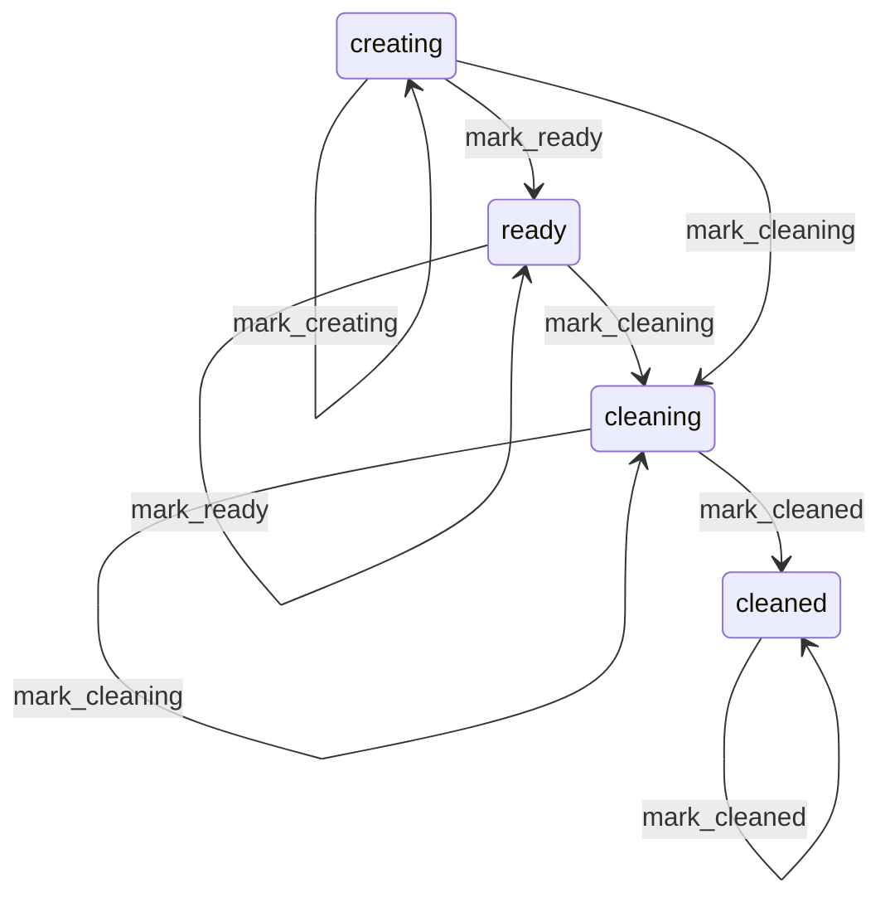
```mermaid
stateDiagram-v2
creating --> creating: mark_creating
creating --> ready: mark_ready
ready --> ready: mark_ready
ready --> cleaning: mark_cleaning
cleaning --> cleaning: mark_cleaning
cleaning --> cleaned: mark_cleaned
cleaned --> cleaned: mark_cleaned
creating --> cleaning: mark_cleaning
```

## Lilly.Lifecycle.CloneCopy

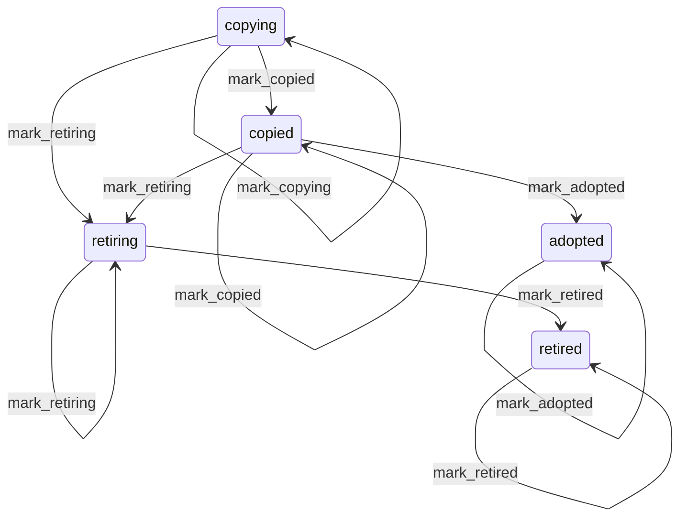
```mermaid
stateDiagram-v2
copying --> copying: mark_copying
copying --> retiring: mark_retiring
retiring --> retiring: mark_retiring
retiring --> retired: mark_retired
retired --> retired: mark_retired
copying --> copied: mark_copied
copied --> retiring: mark_retiring
copied --> copied: mark_copied
copied --> adopted: mark_adopted
adopted --> adopted: mark_adopted
```

## Lilly.Lifecycle.Dataset

```mermaid
stateDiagram-v2
creating --> creating: mark_creating
creating --> bound: mark_bound
bound --> bound: mark_bound
bound --> ready: mark_ready
ready --> ready: mark_ready
ready --> import-deleting: mark_import-deleting
import-deleting --> import-deleting: mark_import-deleting
import-deleting --> deleted: mark_deleted
deleted --> deleted: mark_deleted
ready --> deleting: mark_deleting
deleting --> deleting: mark_deleting
deleting --> deleted: mark_deleted
bound --> deleting: mark_deleting
creating --> deleting: mark_deleting
importing --> importing: mark_importing
importing --> import-pruned: mark_import-pruned
import-pruned --> import-pruned: mark_import-pruned
import-pruned --> import-publishing: mark_import-publishing
import-publishing --> ready: mark_ready
import-publishing --> import-publishing: mark_import-publishing
import-publishing --> import-deleting: mark_import-deleting
import-pruned --> import-deleting: mark_import-deleting
importing --> import-deleting: mark_import-deleting
```

## Lilly.Lifecycle.Execution

```mermaid
stateDiagram-v2
idle --> idle: mark_idle
idle --> starting: mark_starting
starting --> starting: mark_starting
starting --> running: mark_running
running --> starting: mark_starting
running --> running: mark_running
running --> stopping: mark_stopping
stopping --> starting: mark_starting
stopping --> running: mark_running
stopping --> stopping: mark_stopping
stopping --> stopped: mark_stopped
stopped --> starting: mark_starting
stopped --> running: mark_running
stopped --> stopping: mark_stopping
stopped --> stopped: mark_stopped
stopped --> resizing: mark_resizing
resizing --> starting: mark_starting
resizing --> stopping: mark_stopping
resizing --> stopped: mark_stopped
resizing --> resizing: mark_resizing
resizing --> deleting: mark_deleting
deleting --> running: mark_running
deleting --> stopped: mark_stopped
deleting --> deleting: mark_deleting
deleting --> failed: mark_failed
failed --> starting: mark_starting
failed --> running: mark_running
failed --> stopping: mark_stopping
failed --> stopped: mark_stopped
failed --> resizing: mark_resizing
failed --> deleting: mark_deleting
failed --> failed: mark_failed
failed --> unknown: mark_unknown
unknown --> starting: mark_starting
unknown --> running: mark_running
unknown --> stopping: mark_stopping
unknown --> stopped: mark_stopped
unknown --> resizing: mark_resizing
unknown --> deleting: mark_deleting
unknown --> failed: mark_failed
unknown --> unknown: mark_unknown
unknown --> deleted: mark_deleted
deleted --> deleting: mark_deleting
deleted --> deleted: mark_deleted
failed --> deleted: mark_deleted
deleting --> unknown: mark_unknown
deleting --> deleted: mark_deleted
resizing --> failed: mark_failed
resizing --> unknown: mark_unknown
stopped --> deleting: mark_deleting
stopped --> failed: mark_failed
stopped --> unknown: mark_unknown
stopped --> deleted: mark_deleted
stopping --> resizing: mark_resizing
stopping --> deleting: mark_deleting
stopping --> failed: mark_failed
stopping --> unknown: mark_unknown
running --> stopped: mark_stopped
running --> resizing: mark_resizing
running --> deleting: mark_deleting
running --> failed: mark_failed
running --> unknown: mark_unknown
running --> deleted: mark_deleted
starting --> stopping: mark_stopping
starting --> stopped: mark_stopped
starting --> resizing: mark_resizing
starting --> deleting: mark_deleting
starting --> failed: mark_failed
starting --> unknown: mark_unknown
idle --> stopping: mark_stopping
idle --> resizing: mark_resizing
idle --> deleting: mark_deleting
```

## Lilly.Lifecycle.GuestTrust

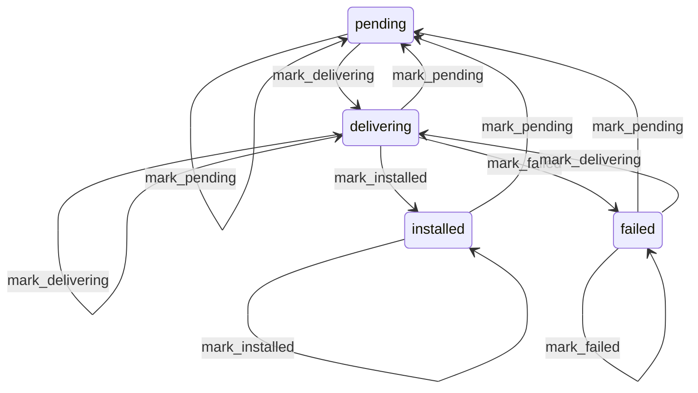
```mermaid
stateDiagram-v2
pending --> pending: mark_pending
pending --> delivering: mark_delivering
delivering --> pending: mark_pending
delivering --> delivering: mark_delivering
delivering --> installed: mark_installed
installed --> pending: mark_pending
installed --> installed: mark_installed
delivering --> failed: mark_failed
failed --> pending: mark_pending
failed --> delivering: mark_delivering
failed --> failed: mark_failed
```

## Lilly.Lifecycle.ImageTemplate

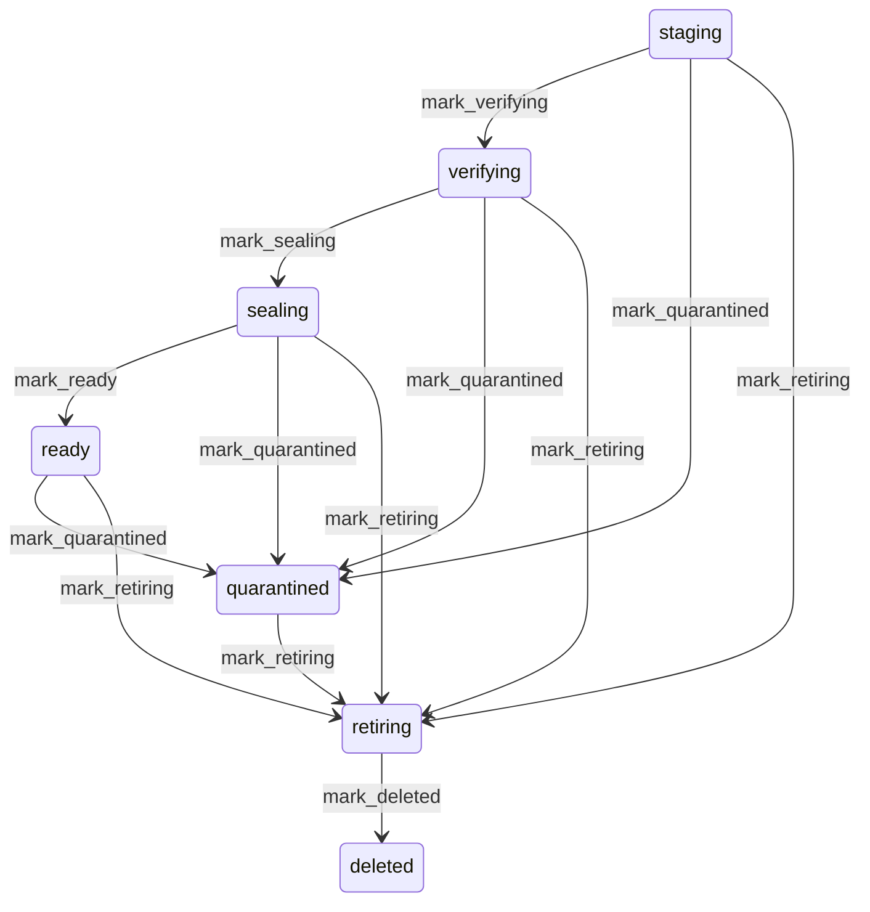
```mermaid
stateDiagram-v2
staging --> verifying: mark_verifying
verifying --> sealing: mark_sealing
sealing --> ready: mark_ready
ready --> quarantined: mark_quarantined
quarantined --> retiring: mark_retiring
retiring --> deleted: mark_deleted
ready --> retiring: mark_retiring
sealing --> quarantined: mark_quarantined
sealing --> retiring: mark_retiring
verifying --> quarantined: mark_quarantined
verifying --> retiring: mark_retiring
staging --> quarantined: mark_quarantined
staging --> retiring: mark_retiring
```

## Lilly.Lifecycle.Import

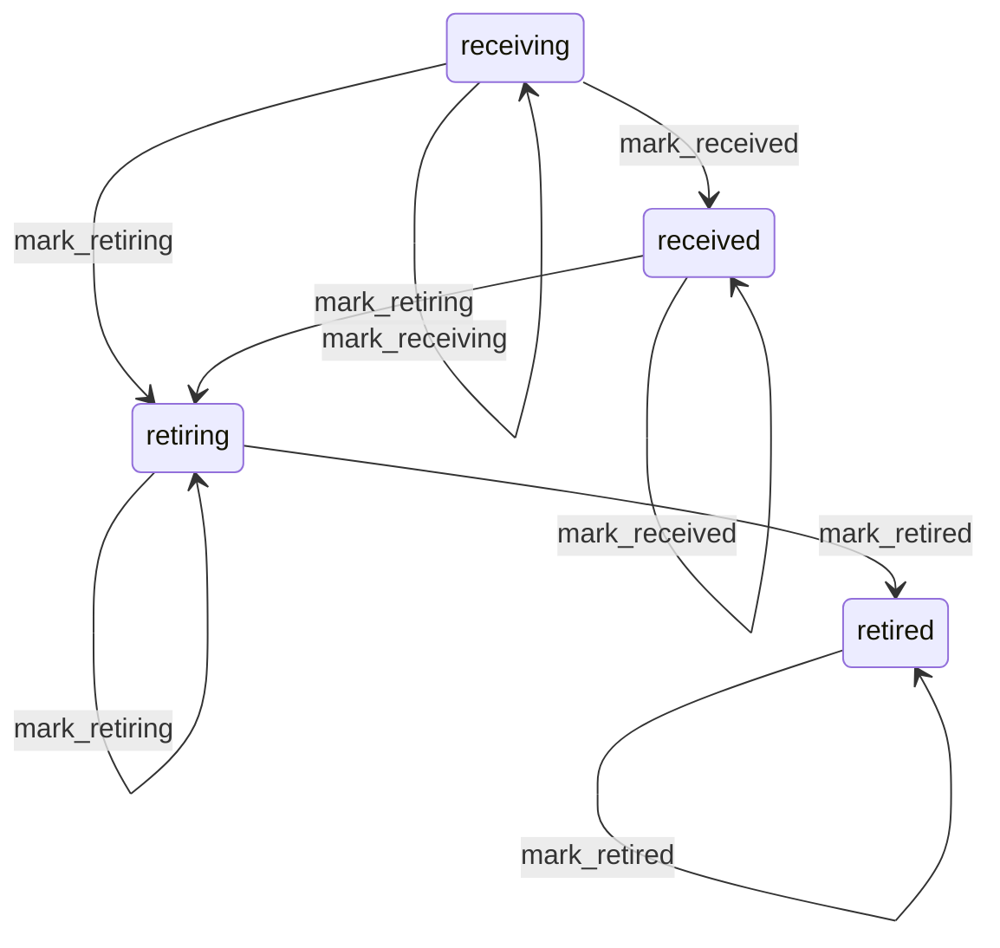
```mermaid
stateDiagram-v2
receiving --> receiving: mark_receiving
receiving --> retiring: mark_retiring
retiring --> retiring: mark_retiring
retiring --> retired: mark_retired
retired --> retired: mark_retired
receiving --> received: mark_received
received --> retiring: mark_retiring
received --> received: mark_received
```

## Lilly.Lifecycle.Permit

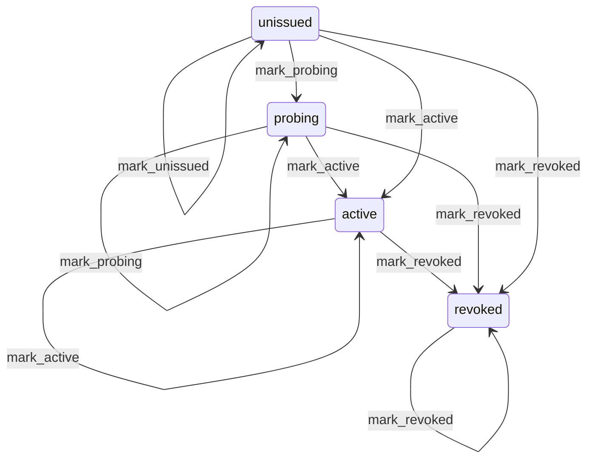
```mermaid
stateDiagram-v2
unissued --> unissued: mark_unissued
unissued --> probing: mark_probing
probing --> probing: mark_probing
probing --> active: mark_active
active --> active: mark_active
active --> revoked: mark_revoked
revoked --> revoked: mark_revoked
probing --> revoked: mark_revoked
unissued --> active: mark_active
unissued --> revoked: mark_revoked
```

## Lilly.Lifecycle.Provisioning

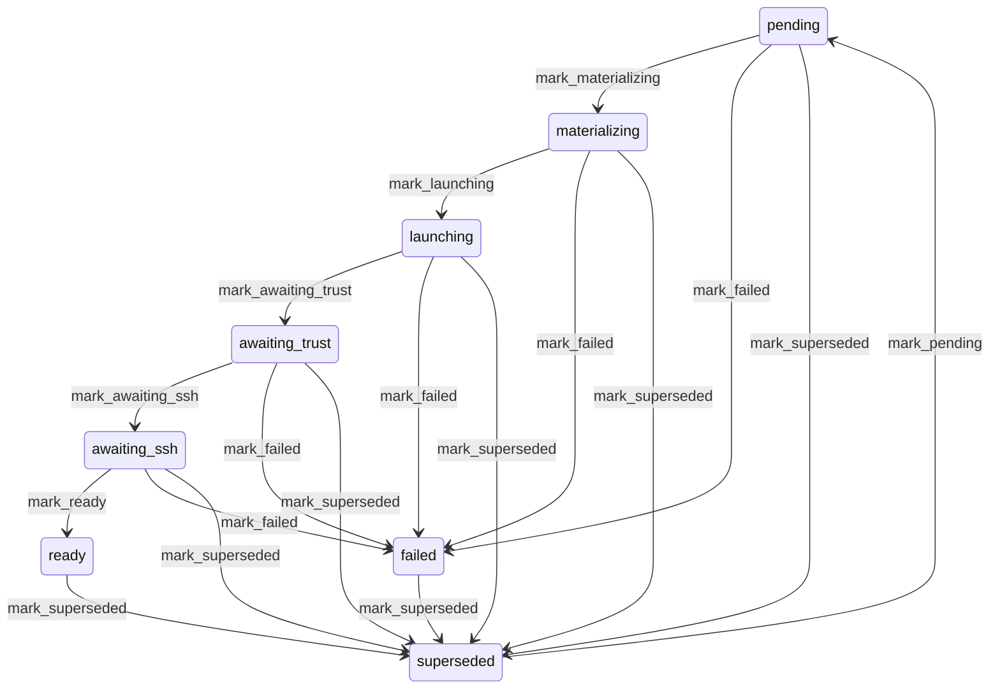
```mermaid
stateDiagram-v2
pending --> materializing: mark_materializing
materializing --> launching: mark_launching
launching --> awaiting_trust: mark_awaiting_trust
awaiting_trust --> awaiting_ssh: mark_awaiting_ssh
awaiting_ssh --> ready: mark_ready
ready --> superseded: mark_superseded
superseded --> pending: mark_pending
awaiting_ssh --> failed: mark_failed
failed --> superseded: mark_superseded
awaiting_ssh --> superseded: mark_superseded
awaiting_trust --> failed: mark_failed
awaiting_trust --> superseded: mark_superseded
launching --> failed: mark_failed
launching --> superseded: mark_superseded
materializing --> failed: mark_failed
materializing --> superseded: mark_superseded
pending --> failed: mark_failed
pending --> superseded: mark_superseded
```

## Lilly.Lifecycle.Resize

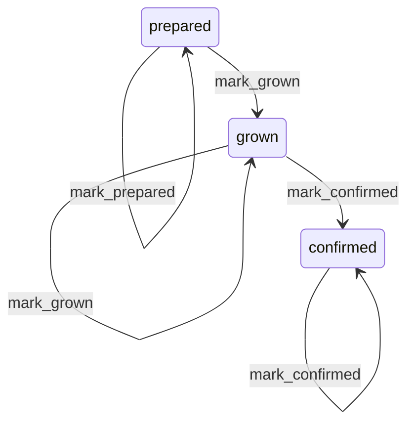
```mermaid
stateDiagram-v2
prepared --> prepared: mark_prepared
prepared --> grown: mark_grown
grown --> grown: mark_grown
grown --> confirmed: mark_confirmed
confirmed --> confirmed: mark_confirmed
```

## Lilly.Lifecycle.SnapshotPointer

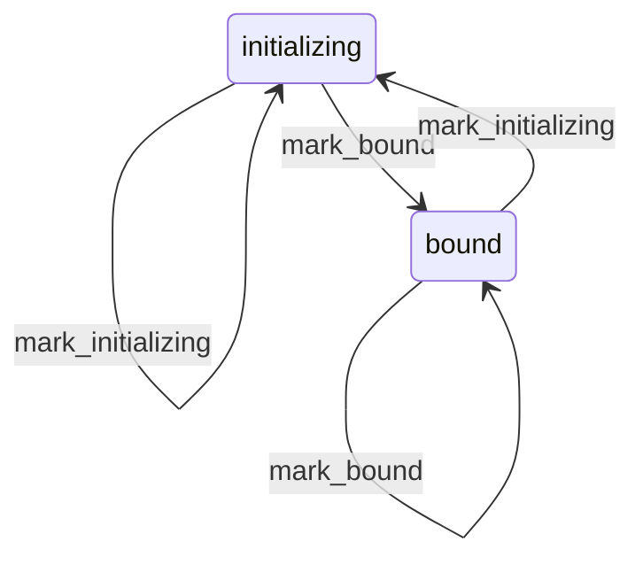
```mermaid
stateDiagram-v2
initializing --> initializing: mark_initializing
initializing --> bound: mark_bound
bound --> initializing: mark_initializing
bound --> bound: mark_bound
```

## Lilly.Lifecycle.SnapshotSet

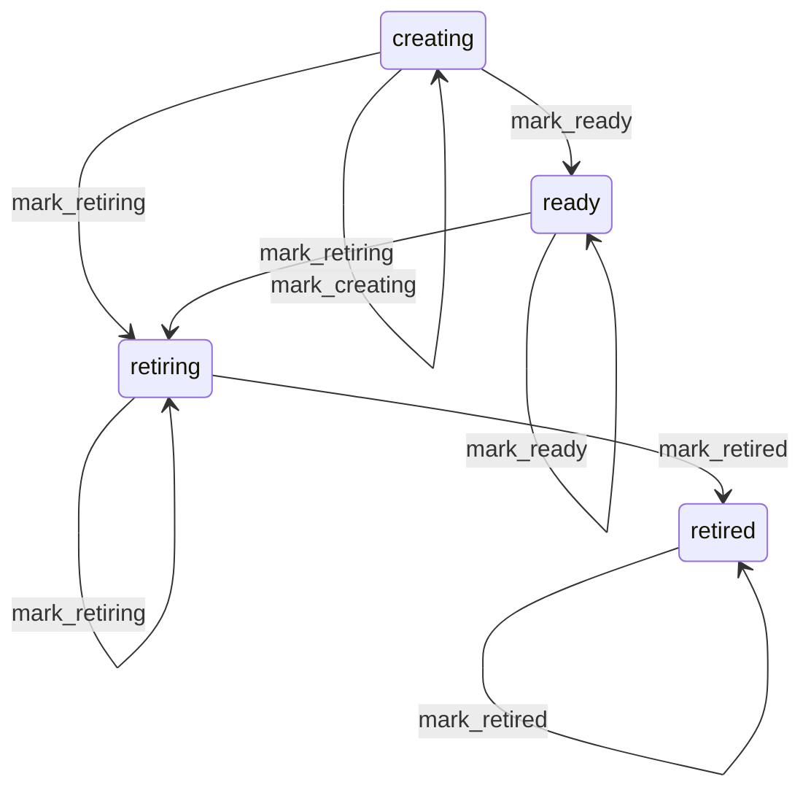
```mermaid
stateDiagram-v2
creating --> creating: mark_creating
creating --> retiring: mark_retiring
retiring --> retiring: mark_retiring
retiring --> retired: mark_retired
retired --> retired: mark_retired
creating --> ready: mark_ready
ready --> retiring: mark_retiring
ready --> ready: mark_ready
```

## Lilly.Lifecycle.StandbyDisk

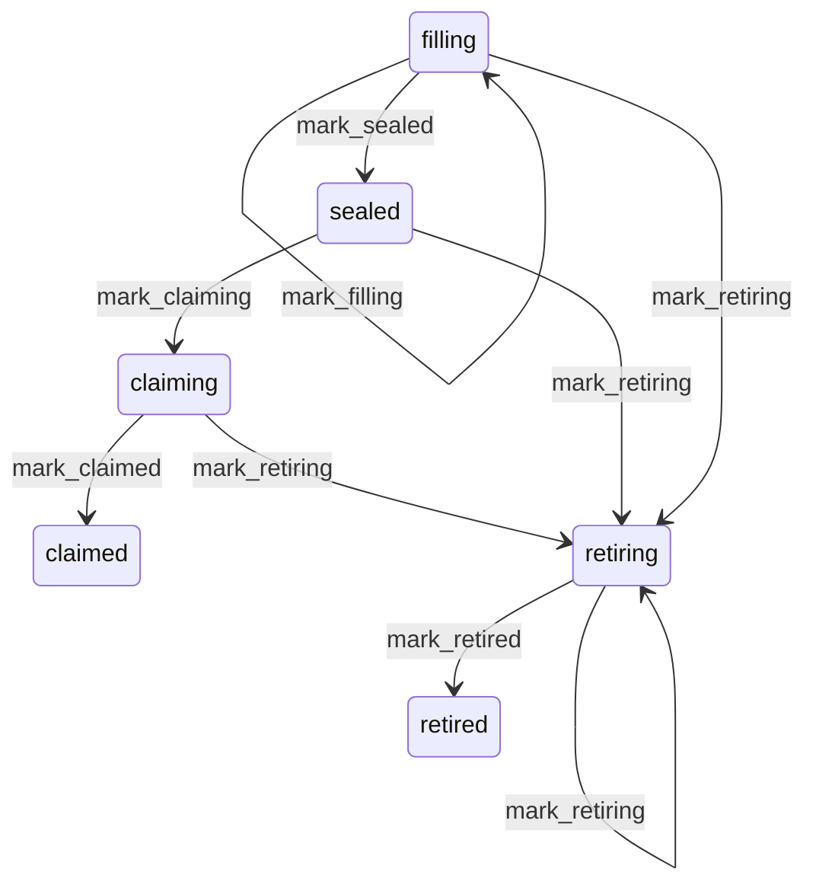
```mermaid
stateDiagram-v2
filling --> filling: mark_filling
filling --> sealed: mark_sealed
sealed --> claiming: mark_claiming
claiming --> claimed: mark_claimed
claiming --> retiring: mark_retiring
retiring --> retiring: mark_retiring
retiring --> retired: mark_retired
sealed --> retiring: mark_retiring
filling --> retiring: mark_retiring
```

## Lilly.Lifecycle.WorkspaceSource

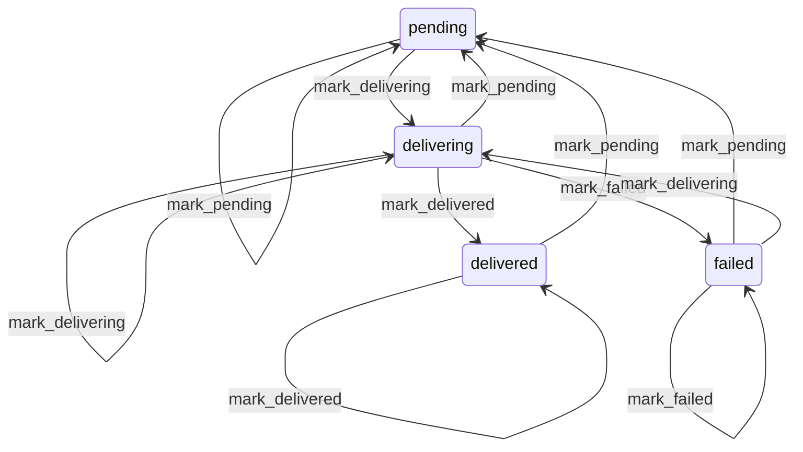
```mermaid
stateDiagram-v2
pending --> pending: mark_pending
pending --> delivering: mark_delivering
delivering --> pending: mark_pending
delivering --> delivering: mark_delivering
delivering --> delivered: mark_delivered
delivered --> pending: mark_pending
delivered --> delivered: mark_delivered
delivering --> failed: mark_failed
failed --> pending: mark_pending
failed --> delivering: mark_delivering
failed --> failed: mark_failed
```

## Marshall.Compute.CleanupRequest

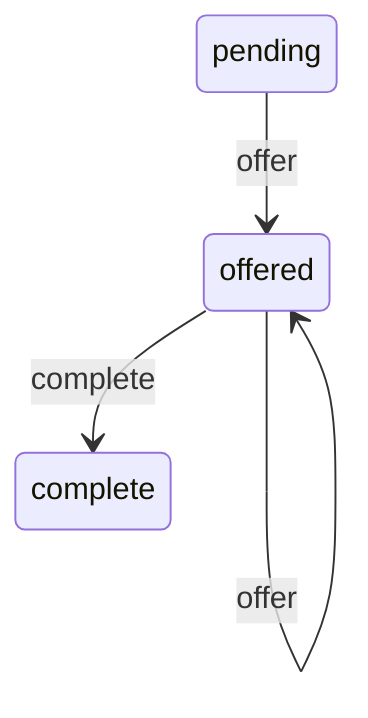
```mermaid
stateDiagram-v2
pending --> offered: offer
offered --> offered: offer
offered --> complete: complete
```

## Marshall.Compute.CloneEffect

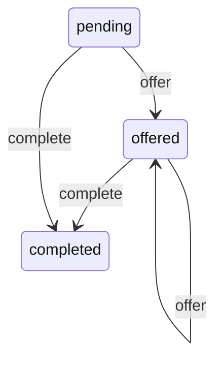
```mermaid
stateDiagram-v2
pending --> offered: offer
offered --> offered: offer
offered --> completed: complete
pending --> completed: complete
```

## Marshall.Compute.CloneRequest

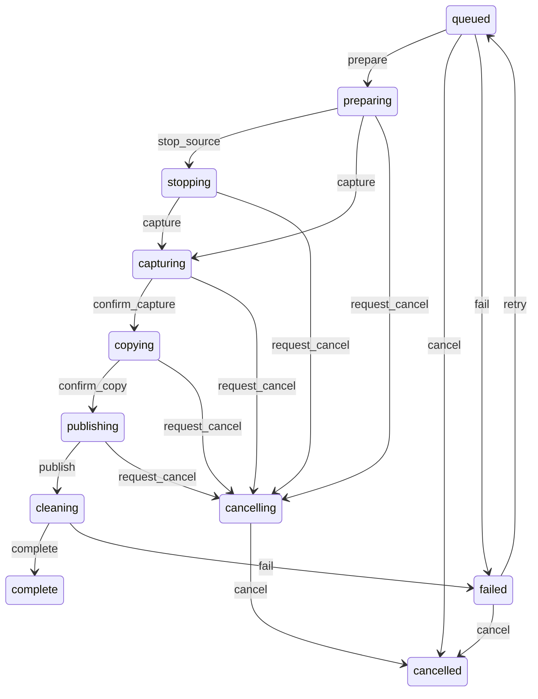
```mermaid
stateDiagram-v2
queued --> preparing: prepare
preparing --> stopping: stop_source
stopping --> capturing: capture
capturing --> copying: confirm_capture
copying --> publishing: confirm_copy
publishing --> cleaning: publish
cleaning --> complete: complete
cleaning --> failed: fail
failed --> cancelled: cancel
failed --> queued: retry
publishing --> cancelling: request_cancel
cancelling --> cancelled: cancel
copying --> cancelling: request_cancel
capturing --> cancelling: request_cancel
stopping --> cancelling: request_cancel
preparing --> capturing: capture
preparing --> cancelling: request_cancel
queued --> cancelled: cancel
queued --> failed: fail
```

## Marshall.Compute.Evacuation

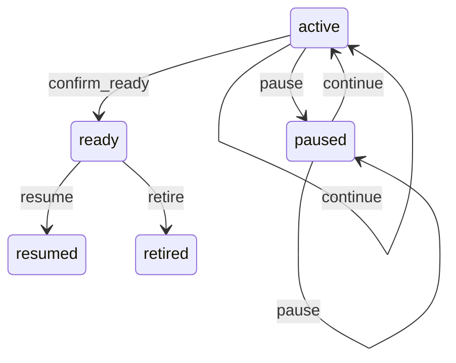
```mermaid
stateDiagram-v2
active --> paused: pause
paused --> paused: pause
paused --> active: continue
active --> active: continue
active --> ready: confirm_ready
ready --> resumed: resume
ready --> retired: retire
```

## Marshall.Compute.EvacuationItem

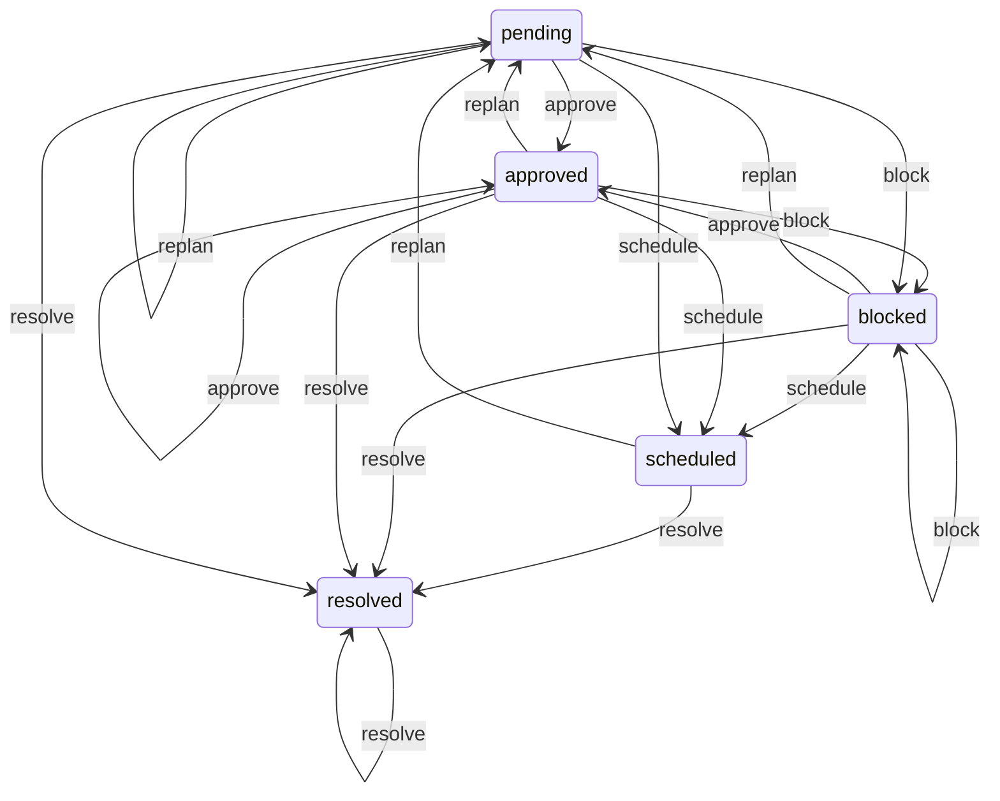
```mermaid
stateDiagram-v2
pending --> approved: approve
approved --> approved: approve
approved --> blocked: block
blocked --> approved: approve
blocked --> blocked: block
blocked --> scheduled: schedule
scheduled --> pending: replan
scheduled --> resolved: resolve
resolved --> resolved: resolve
blocked --> pending: replan
blocked --> resolved: resolve
approved --> scheduled: schedule
approved --> pending: replan
approved --> resolved: resolve
pending --> blocked: block
pending --> scheduled: schedule
pending --> pending: replan
pending --> resolved: resolve
```

## Marshall.Compute.HostDrain

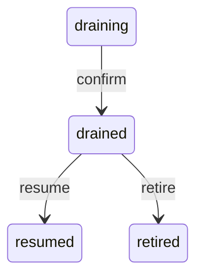
```mermaid
stateDiagram-v2
draining --> drained: confirm
drained --> resumed: resume
drained --> retired: retire
```

## Marshall.Compute.Operation

```mermaid
stateDiagram-v2
pending --> acknowledged: acknowledge
acknowledged --> completed: complete
acknowledged --> cancelled: cancel
cancelled --> completed: complete
pending --> completed: complete
pending --> cancelled: cancel
```

## Marshall.Compute.ProbeRequest

```mermaid
stateDiagram-v2
pending --> applied: record_result
```

## Marshall.Compute.ReadinessRequest

```mermaid
stateDiagram-v2
pending --> ready: ready
pending --> failed: fail
```

## Marshall.Compute.Relocation

```mermaid
stateDiagram-v2
preparing --> checking_transfer: record_key
checking_transfer --> stopping_source: record_stop
stopping_source --> copying: begin_copy
copying --> copying: begin_copy
copying --> importing: begin_import
importing --> handoff: confirm_import
handoff --> checking_destination: record_commit
checking_destination --> source_cleanup: confirm_readiness
source_cleanup --> deleting_copies: request_deletion
deleting_copies --> deleting_copies: record_key
deleting_copies --> deleted: finish_deletion
source_cleanup --> complete: complete
checking_destination --> readiness_failed: fail_readiness
readiness_failed --> retrying_destination: begin_retry
retrying_destination --> checking_destination: record_retry_activation
retrying_destination --> deleting_copies: request_deletion
readiness_failed --> deleting_copies: request_deletion
checking_destination --> activation_failed: fail_activation
activation_failed --> checking_destination: observe_activation
activation_failed --> retrying_destination: begin_retry
activation_failed --> deleting_copies: request_deletion
checking_destination --> retrying_destination: begin_retry
checking_destination --> deleting_copies: request_deletion
handoff --> restoring_source: request_cancellation
restoring_source --> restoring_source: record_key
restoring_source --> cancelled_cleanup: record_source_restored
cancelled_cleanup --> cancelled_cleanup: record_key
cancelled_cleanup --> deleting_copies: request_deletion
cancelled_cleanup --> cancelled: finish_cancellation
restoring_source --> deleting_copies: request_deletion
handoff --> deleting_copies: request_deletion
importing --> restoring_source: request_cancellation
importing --> deleting_copies: request_deletion
copying --> restoring_source: request_cancellation
copying --> deleting_copies: request_deletion
stopping_source --> restoring_source: request_cancellation
stopping_source --> deleting_copies: request_deletion
checking_transfer --> copying: begin_copy
checking_transfer --> restoring_source: request_cancellation
checking_transfer --> deleting_copies: request_deletion
preparing --> restoring_source: request_cancellation
preparing --> deleting_copies: request_deletion
```

## Marshall.Compute.RelocationRetry

```mermaid
stateDiagram-v2
pending --> activated: activate
pending --> superseded: supersede
```

## Marshall.Compute.ResizeRequest

```mermaid
stateDiagram-v2
stopping --> stopping: stop
stopping --> resizing: resize
resizing --> resizing: resize
resizing --> restarting: restart
restarting --> restarting: restart
restarting --> fencing: fence
fencing --> restarting: restart
fencing --> fencing: fence
restarting --> complete: complete
resizing --> complete: complete
```

## Marshall.Compute.ServiceLevelAttempt

```mermaid
stateDiagram-v2
pending --> finished: finish
```

## Marshall.Compute.SourcePermitRequest

```mermaid
stateDiagram-v2
pending --> applied: record_result
applied --> superseded: supersede
pending --> superseded: supersede
```

## Marshall.Compute.VirtualMachine

```mermaid
stateDiagram-v2
running --> running: request_start
running --> stopped: request_stop
stopped --> running: request_start
stopped --> stopped: request_stop
stopped --> deleted: request_delete
deleted --> deleted: request_delete
stopped --> running: handoff
stopped --> stopped: handoff
stopped --> stopped: restore_source
running --> deleted: request_delete
running --> stopped: restore_source
```

## Marshall.Compute.WorkflowServiceLevelAttempt

```mermaid
stateDiagram-v2
pending --> finished: finish
```
